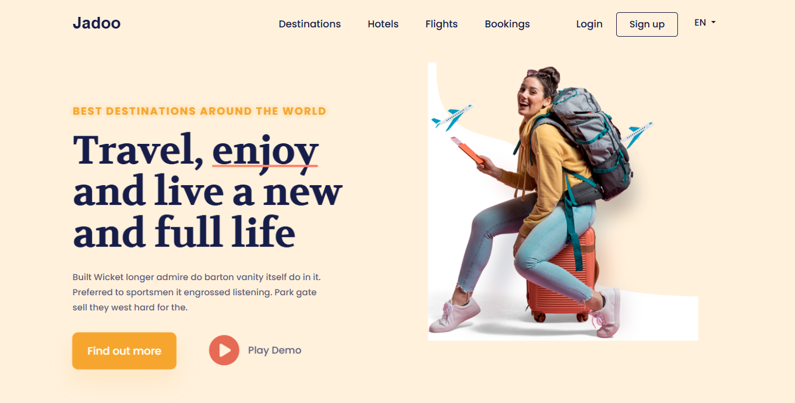

# 🌍 Jadoo Travel Website - Figma to HTML


A beautiful, responsive travel agency landing page built from Figma design to pixel-perfect HTML, CSS, and Bootstrap.

## 📸 Screenshots

<div align="center">
  
  <p><em>Pixel-perfect Figma to HTML conversion of Jadoo travel website with modern animations</em></p>
</div>

## 🚀 Live Demo

[View Live Figma To HTML Conversion Page](https://figma-to-html-shibam.netlify.app)

## 🚀 Features

- **Pixel-Perfect Design** - Exact replication of Figma design
- **Fully Responsive** - Works perfectly on desktop, tablet, and mobile
- **Modern Animations** - Smooth hover effects and subtle animations
- **Mobile-First** - Full-screen mobile navigation menu
- **Clean Code** - Beginner-friendly with extensive comments
- **Bootstrap 5** - Modern CSS framework for layout
- **Google Fonts** - Beautiful typography with Poppins and Volkhov

## 📱 Responsive Design

- **Desktop** (1200px+) - Full layout with side-by-side content
- **Tablet** (768px - 1199px) - Adjusted spacing and font sizes
- **Mobile** (< 768px) - Stacked layout with centered content and full-screen menu

## 🎨 Design Elements

- **Color Scheme**: Cream background with orange accents and dark blue text
- **Typography**: Poppins for body text, Volkhov for headings
- **Animations**: Glowing effects, pulsing buttons, floating airplanes
- **Interactive Elements**: Hover effects on buttons and navigation

## 🛠️ Technologies Used

- **HTML5** - Semantic markup
- **CSS3** - Custom styles with animations
- **Bootstrap 5.3.0** - Responsive grid and components
- **Font Awesome 6.0.0** - Icons for UI elements
- **Google Fonts** - Poppins and Volkhov font families

## 📁 Project Structure

```
figma-to-html-shibam/
├── 📄 index.html                                 # Main HTML file with beginner-friendly comments
├── 🎨 styles.css                                 # Custom CSS styles with animations
├── 🖼️ images/                                    # Image assets folder
│   ├── logo.svg                               # Jadoo company logo
│   └── girl.png                               # Hero section traveler image
├── 📸 screenshot/                              # Project screenshots
│   └── figma-to-html-shibam.png
├── 📖 README.md                                  # Complete project documentation
├── 📜 LICENSE                                    # MIT License for open source
└── 🚫 .gitignore                                 # Git ignore file for version control
```

## 🛠️ Technologies Used

<table>
<tr>
<td align="center"><br><b>HTML5</b></td>
<td align="center"><br><b>CSS3</b></td>
<td align="center"><br><b>Bootstrap</b></td>
<td align="center"><br><b>Figma</b></td>
</tr>
</table>

## 📝 Commit History

This project was developed through 5 key commits:

1. **init** - Initial project setup and basic file structure
2. **hero** - Hero section implementation with animations and responsive design
3. **features grid** - Features section with grid layout and interactive elements
4. **responsive tweaks** - Mobile responsiveness improvements and cross-device optimization
5. **docs** - Documentation updates and project finalization

## 🚀 Getting Started

1. **Clone or Download** the project files
2. **Open** `index.html` in your web browser
3. **That's it!** The website is ready to view

### Local Development

```bash
# Simply open the HTML file in any web browser
# No build process required - it's pure HTML, CSS, and Bootstrap!
```

## 📖 Code Structure

### HTML (`index.html`)
- Clean, semantic HTML5 structure
- Bootstrap classes for responsive layout
- Extensive comments explaining each section

### CSS (`styles.css`)
- Custom CSS variables for easy color management
- Responsive design with mobile-first approach
- Smooth animations and hover effects
- Beginner-friendly comments throughout

## 🎯 Key Features Explained

### Navigation
- Fixed navbar that stays at top when scrolling
- Collapsible mobile menu with full-screen overlay
- Smooth hover effects on menu items

### Hero Section
- Large, eye-catching title with animated underline
- Two call-to-action buttons with different styles
- Floating airplane animations for visual interest
- Responsive image that scales on all devices

### Animations
- **Gentle Glow** - Subtitle pulsing effect
- **Subtle Pulse** - Main title breathing animation
- **Button Shimmer** - Light sweep effect on main button
- **Play Button Pulse** - Pulsing play button
- **Floating Airplanes** - Decorative elements that float

## 🎨 Customization

### Colors
Edit the CSS variables in `styles.css`:
```css
:root {
    --orange-color: #F1A501;     /* Main orange color */
    --dark-blue: #181E4B;        /* Dark blue for text */
    --gray-text: #5E6282;        /* Gray for descriptions */
    --cream-bg: #FFF1DA;         /* Cream background */
}
```

### Fonts
Change fonts by updating the Google Fonts link in `index.html` and CSS font-family properties.

### Content
Update text content directly in `index.html` - all text is easily editable.

## 📱 Mobile Features

- Full-screen navigation menu
- Touch-friendly button sizes
- Optimized text sizes for mobile reading
- Horizontal button layout on small screens
- Responsive images that scale properly

## 🌟 Browser Support

- Chrome (latest)
- Firefox (latest)
- Safari (latest)
- Edge (latest)
- Mobile browsers (iOS Safari, Chrome Mobile)

## 📄 License

This project is licensed under the MIT License - see the [LICENSE](LICENSE) file for details.

## 🤝 Contributing

This is a learning project! Feel free to:
- Fork the repository
- Make improvements
- Submit pull requests
- Report issues

## 📞 Support

If you have questions about the code or need help understanding any part, the code is extensively commented to help beginners learn web development.

## 🎓 Learning Resources

This project demonstrates:
- HTML5 semantic structure
- CSS3 animations and transitions
- Bootstrap responsive grid system
- Mobile-first responsive design
- CSS custom properties (variables)
- Flexbox layout techniques

---

**Made with ❤️ for learning web development**

---

## 📞 Contact

- **Email**: Connect-With-Shibam@outlook.com
- **LinkedIn**: [linkedin.com/in/shibam-webdev](https://linkedin.com/in/shibam-webdev)
- **GitHub**: [github.com/Shibam-Code-Pro](https://github.com/Shibam-Code-Pro)

---

⭐ If you found this project helpful, please give it a star on GitHub!
